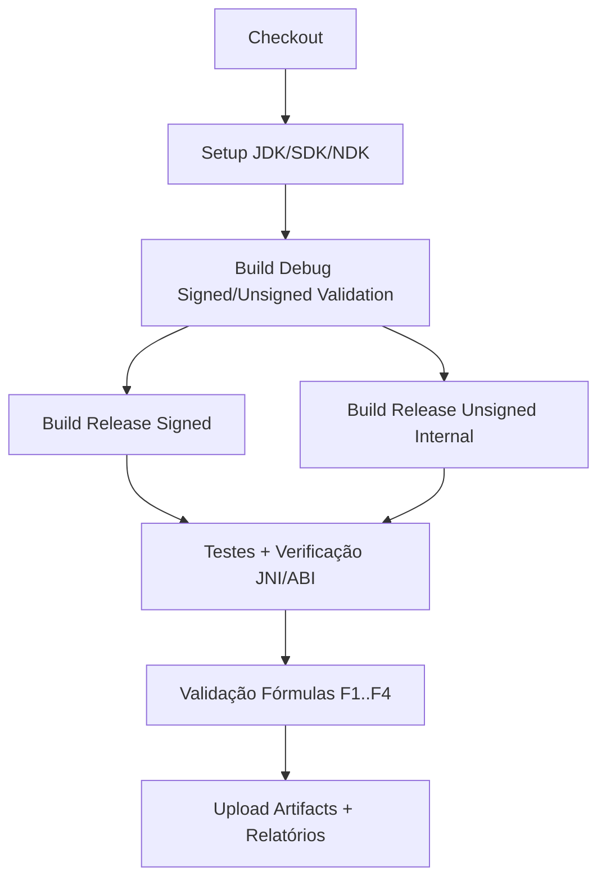

# Material Técnico: Assembler Inline Puro, Orquestração Hardware/Software, Recursos, Ruído, Flags e Compiladores

> **Proteção inicial por convenção BENAR**  
> Este material é de autoria técnica e intelectual de **RafaelMeloReis** e estabelece convenção de uso e referência interna em contexto acadêmico-profissional, com validação contínua por CI.

## 1. Escopo técnico

Este documento consolida fundamentos de baixo nível para integração nativa Android (NDK/JNI), com foco em:

- assembler inline puro;
- orquestração hardware/software;
- recursos e pressão de runtime;
- ruído sistêmico e estabilidade;
- flags de compilação e ABI;
- validação formal em CI baseada em fórmulas e grafos.

## 2. Assembler inline puro: fundamentos operacionais

Assembler inline permite controle explícito de instruções críticas sem romper o fluxo do compilador C/C++.

### 2.1 Estrutura canônica

```c
static inline uint64_t add_u64(uint64_t a, uint64_t b) {
    uint64_t r;
    __asm__ __volatile__(
        "add %0, %1, %2\n"
        : "=r"(r)
        : "r"(a), "r"(b)
        : "cc"
    );
    return r;
}
```

### 2.2 Regras de robustez

1. Declarar corretamente **operandos de saída, entrada e clobbers**.
2. Preservar semântica de memória com `"memory"` quando necessário.
3. Restringir asm inline a caminhos críticos e verificáveis.
4. Garantir fallback puro em C para portabilidade e teste diferencial.

## 3. Orquestração hardware/software

A coerência entre camadas exige contratos formais entre:

- ISA/ABI (ARMv7 `armeabi-v7a` e AArch64 `arm64-v8a`);
- compilador/otimizador (Clang/LLVM);
- runtime Android/ART;
- JNI boundary e gestão de buffers.

### 3.1 Princípios

- minimizar fronteiras JNI por lote de operação;
- alinhar dados para reduzir penalidade de acesso;
- controlar afinidade e contenção quando houver paralelismo nativo;
- usar feature-detection e não suposições de microarquitetura.

## 4. Recursos e ruído

Ruído operacional é tratado como observável de fronteira de estabilidade.

### 4.1 Fontes de ruído

- jitter de agendamento;
- thermal throttling;
- variações de frequência;
- pressão de memória/cache;
- contenção de lock e preempção.

### 4.2 Estratégia

- medir com repetição estatística;
- validar tendência, não amostra isolada;
- classificar regressão por desvio relativo e intervalo de confiança.

## 5. Flags e controle de compilação

### 5.1 Base recomendada por perfil

- **Debug**: `-O0 -g3 -fno-omit-frame-pointer`
- **Release validado**: `-O2 -DNDEBUG -fstack-protector-strong`
- **Hardening opcional**: `-fvisibility=hidden -Wl,-z,relro,-z,now`

### 5.2 Sanitização em trilha interna

- ASan/UBSan em jobs dedicados de validação;
- nunca substituir release oficial por artefato sanitizado;
- manter trilhas separadas entre validação interna e distribuição.

## 6. Fórmulas de verificação e coerência

Conjunto mínimo para CI:

- **F1** (Cobertura de ABI): `C_ABI = N_abi_ok / N_abi_total`
- **F2** (Integridade de artefato): `I_art = N_hash_ok / N_hash_total`
- **F3** (Estabilidade temporal): `E_t = 1 - (sigma/mean)`
- **F4** (Consistência de grafo): `G_c = N_edges_validas / N_edges_total`

Condição-alvo de passagem:

- `C_ABI = 1.0`
- `I_art = 1.0`
- `E_t >= 0.90`
- `G_c = 1.0`

## 7. Grafo de aplicações no fluxo de CI



## 8. Autor e responsabilidade técnica

Documento técnico redigido e estruturado por **RafaelMeloReis** para uso profissional, com linguagem formal e validação contínua em pipeline de CI.

## 9. Observações iniciais (convenção BENAR)

1. Não promover artefato unsigned a release oficial.
2. Não remover verificações de ABI para reduzir tempo de pipeline.
3. Não ocultar falha estrutural com retry cego.
4. Priorizar integridade, rastreabilidade e reprodutibilidade.
